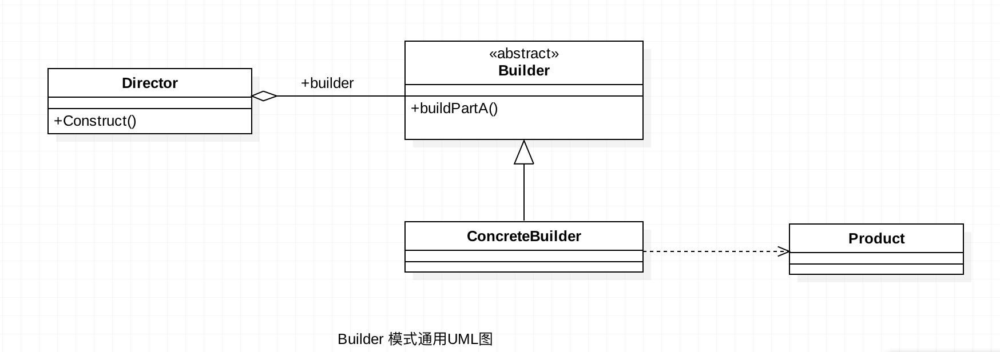

# Android 建造者（Builder）模式

## 前言

正所谓只要功夫深，铁杵磨成针，坚持不懈，水滴石穿。学习也要坚持不懈，慢慢积累，才能达到以量变促成质变。在前进的过程中也要保持好良好的心态，不急不燥，脚踏实地，一步一个脚印。

## Builder Design Pattern 介绍

* 建造者模式（Builder Pattern）也叫做生成器模式，Builder Design pattern  是一种**创造型模式**，Builder模式所解决的问题与对象的创建有关。它允许用户在不知道内部构建细节的情况下，可以更精细的控制对象的构造流程，Builder模式是为了将构造复杂对象的过程和他的部件解耦。Android 中我们最常用的Builder模式是AlterDialog.Builder。

* Builder 模式通常是以静态内部类的形式实现。

    <!-- more -->

## Builder Design Pattern 定义

​	将一个复杂对象的构建过程与他的表示分离，使得同样的构建过程可以创建不同的表示。


## Builder Design Pattern 使用场景

* 需要太多的构造函数。
* 当初始化一个对象特别复杂，如参数多，并且很多参数具有默认值时。
* 配置类的构造器的构建，将配置与目标类隔离出来（参照[Universal-Image_Loader](https://github.com/nostra13/Android-Universal-Image-Loader)）。
* 相同的方法，不同的执行顺序，产生不同的事件结果时。
* 多个部件或零件，都可以装配到一个对象中，但是产生的运行结果不同时。
* 产品类非常复杂，或者产品类中的调用顺序不同产生了不同的效能。


## Builder Design Pattern 通用UML类图



**说明：**

*  **Product产品类**
    ConcreateBuilder 创建该产品的内部表示，并定义它的装配过程。

*  **Builder抽象建造者**

    规范产品的组建，一般是由子类实现。

*  **ConcreateBuilder 具体建造者**

    实现抽象类定义的所有方法，并且返回一个组建好的对象。

*  **Director导演类**

    负责安排已有模块的顺序，然后告诉Builder开始建造。


## Builder Design Pattern 使用实例

### 标准化的建造者（Builder）模式使用实例

我们以组建一台自己心仪的台式机电脑为例；

1.    电脑抽象类

      ``` java
      /**
      * Created by iuni.life on 16/8/2.
      * 组建一台简单的台式机电脑,电脑抽象类 即Product角色
      */
      public class Computer {
         //cpu
         protected String mCpu = "intel i3-4150";
         //显示器
         protected String mDisplay = "21寸";
         //主板
         protected String mBoard = "华硕 B85";
         //电源
         protected String mPower = "安钛克 220V";
         //系统
         protected String mSysOs = "Dos";
         //主机箱
         protected String mMainBox = "先马";
         //鼠标
         protected String mMouse = "贱驴";
         //键盘
         protected String mKeyBoard = "cherry";
         //内存条
         protected String mSimm = "2*4G";
         //硬盘
         protected String mHardDisk = "希捷 1T";

         protected ComputerStant() {
         }

         public abstract void setSimm(String simm);

         public abstract void setHardDisk(String hardDisk);

         public abstract void setCpu(String cpu);

         public abstract void setDisplay(String display);

         public abstract void setBoard(String board);

         public abstract void setPower(String power);

         public abstract void setSysOs(String sysOs);

         public abstract void setMainBox(String mainBox);

         public abstract void setMouse(String mouse);

         public abstract void setKeyBoard(String keyBoard);

         @Override
         public String toString() {
             return "ComputerStant{" +
                     "mCpu='" + mCpu + '\'' +
                     ", mDisplay='" + mDisplay + '\'' +
                     ", mBoard='" + mBoard + '\'' +
                     ", mPower='" + mPower + '\'' +
                     ", mSysOs='" + mSysOs + '\'' +
                     ", mMainBox='" + mMainBox + '\'' +
                     ", mMouse='" + mMouse + '\'' +
                     ", mKeyBoard='" + mKeyBoard + '\'' +
                     ", mSimm='" + mSimm + '\'' +
                     ", mHardDisk='" + mHardDisk + '\'' +
                     '}';
         }
      }
      ```

2.    电脑抽象类的具体实现，我们以Mac电脑为例

      ```java
            /**
      * Created by iuni.life on 16/8/2.
      *
      */
      public class MacComputer extends Computer {

         protected MacComputer() {
         }
        
         @Override
         public void setSimm(String simm) {
             mSimm = simm;
         }

         @Override
         public void setHardDisk(String hardDisk) {
             mHardDisk = hardDisk;
         }

         @Override
         public void setCpu(String cpu) {
             mCpu = cpu;
         }

         @Override
         public void setDisplay(String display) {
             mDisplay = display;
         }

         @Override
         public void setBoard(String board) {
             mBoard = board;
         }

         @Override
         public void setPower(String power) {
             mPower = power;
         }

         @Override
         public void setSysOs(String sysOs) {
             mSysOs = sysOs;
         }

         @Override
         public void setMainBox(String mainBox) {
             mMainBox = mainBox;
         }

         @Override
         public void setMouse(String mouse) {
             mMouse = mouse;
         }

         @Override
         public void setKeyBoard(String keyBoard) {
             mKeyBoard = keyBoard;
         }
        } 
      ```

3.    Builder抽象类

      ```java
            /**
      * Created by iuni.life on 16/8/2.
      * builder 抽象类
      */
      public abstract class Builder {
         //创建显示器
         public abstract Builder buildDisplay(String display);

         //创建主板
         public abstract Builder buildBoard(String board);

         //创建电源
         public abstract Builder buildPower(String power);

         //创建cpu
         public abstract Builder buildCpu(String cpu);

         //创建系统
         public abstract Builder buildSysOs(String sysOs);

         //创建主机箱
         public abstract Builder buildMainBox(String mainBox);

         //创建鼠标
         public abstract Builder buildMouse(String mouse);

         //创建键盘
         public abstract Builder buildKeyBoard(String keyBoard);

         //创建内存条
         public abstract Builder buildSimm(String simm);

         //创建硬盘
         public abstract Builder buildHardDisk(String hardDisk);

         //创建Computer
         public abstract ComputerStant create();
      }
      ```

4.    Builder 的具体实现，因为我们是要组装一个Mac 电脑，所以需要MacBuilder

      ```java
            /**
      * Created by iuni.life on 16/8/2.
      */
       public class MacBuilder extends Builder {
           MacComputer macComputer = new MacComputer();

           @Override
           public Builder buildDisplay(String display) {
               macComputer.setDisplay(display);
               return this;
           }

           @Override
           public Builder buildBoard(String board) {
               macComputer.setBoard(board);
               return this;
           }

           @Override
           public Builder buildPower(String power) {
               macComputer.setPower(power);
               return this;
           }

           @Override
           public Builder buildCpu(String cpu) {
               macComputer.setCpu(cpu);
               return this;
           }

           @Override
           public Builder buildSysOs(String sysOs) {
               macComputer.setSysOs(sysOs);
               return this;
           }

           @Override
           public Builder buildMainBox(String mainBox) {
               macComputer.setMainBox(mainBox);
               return this;
           }

           @Override
           public Builder buildMouse(String mouse) {
               macComputer.setMouse(mouse);
               return this;
           }

           @Override
           public Builder buildKeyBoard(String keyBoard) {
               macComputer.setKeyBoard(keyBoard);
               return this;
           }

           @Override
           public Builder buildSimm(String simm) {
               macComputer.setSimm(simm);
               return this;
           }

           @Override
           public Builder buildHardDisk(String hardDisk) {
               macComputer.setHardDisk(hardDisk);
               return this;
           }

           @Override
           public ComputerStant create() {
               return macComputer;
           }
       }
      ```

5.    Director 导演类

      ```java
            /**
      * Created by iuni.life on 16/8/2.
      */
        public class Director {
            Builder mBuilder = null;
            
          public Director(Builder mBuilder) {
               this.mBuilder = mBuilder;
           }

           //构建对象
           public void constract(String mCpu, String mDisplay, String mBoard, String mPower, String mSysOs, String mMainBox, String mMouse, String mKeyBoard, String mSimm, String mHardDisk) {
               mBuilder.buildCpu(mCpu);
               mBuilder.buildDisplay(mDisplay);
               mBuilder.buildBoard(mBoard);
               mBuilder.buildPower(mPower);
               mBuilder.buildSysOs(mSysOs);
               mBuilder.buildMainBox(mMainBox);
               mBuilder.buildMouse(mMouse);
               mBuilder.buildKeyBoard(mKeyBoard);
               mBuilder.buildSimm(mSimm);
               mBuilder.buildHardDisk(mHardDisk);
               //也可链式
        //        mBuilder.buildMouse(mMouse).buildCpu(mCpu).buildPower(mPower);
           }
        }
      ```

6.    测试类 test

      ```java
            /**
      * Created by iuni.life on 16/8/2.
      * 经典的Builder模式实现较为繁琐,文章后面会列举一个简单的
      */
       public class Test {
           public static void main(String[] args) {
               //构造器
               Builder builder = new MacBuilder();
               //Director
               Director director = new Director(builder);

               //封装构建过程
               director.constract("intel i7", "25寸", "华硕 B85", "安钛克220V", "Mac Os", "先马", "精灵 X5", "cherry", "2*8G", "希捷500G");

               //构建电脑,输出相关信息

               System.out.println("My Mac Computer Info:"+builder.create().toString());
       //        通过Builder来构建产品对象, 而Director封装了构建复杂产品对象对象的过程，对外隐藏构建细节。
           }
       }
      ```
* **说明**

  通过Builder来构建产品对象, 而Director封装了构建复杂产品对象对象的过程，对外隐藏构建细节。但是这种经典的写法有点小烦，有点繁琐，在要求不是很苛刻的情况下，我们可以用下面的方式进行实现。

  ### 一种简单的方式实现Builder模式

  1. 这种方式以Builder为静态内部类的方式实现，我们还是以组装一台自己的电脑为例。

  ```java
  /**
   * Created by iuni.life on 16/8/2.
   * 组建一台简单的台式机电脑,电脑抽象类 即Product角色
   */
  public class Computer {
      //cpu
      private String cpu;
      //显示器
      private String display;
      //主板
      private String board;
      //电源
      private String power;
      //系统
      private String sysOs;
      //主机箱
      private String mainBox;
      //鼠标
      private String mouse;
      //键盘
      private String keyBoard;

      //私有化构造函数 使之不能从外部创建实例
      private Computer() {
      }

      private void setCpu(String cpu) {
          this.cpu = cpu;
      }

      private void setDisplay(String display) {
          this.display = display;
      }

      private void setBoard(String board) {
          this.board = board;
      }

      private void setPower(String power) {
          this.power = power;
      }

      private void setSysOs(String sysOs) {
          this.sysOs = sysOs;
      }

      private void setMainBox(String mainBox) {
          this.mainBox = mainBox;
      }

      private void setMouse(String mouse) {
          this.mouse = mouse;
      }

      private void setKeyBoard(String keyBoard) {
          this.keyBoard = keyBoard;
      }

      @Override
      public String toString() {
          return "Computer{" +
                  "cpu='" + cpu + '\'' +
                  ", display='" + display + '\'' +
                  ", board='" + board + '\'' +
                  ", power='" + power + '\'' +
                  ", sysOs='" + sysOs + '\'' +
                  ", mainBox='" + mainBox + '\'' +
                  ", mouse='" + mouse + '\'' +
                  ", keyBoard='" + keyBoard + '\'' +
                  '}';
      }
  	//Builder 静态内部类
      public static class ComputerBuilder {
          //创建computer实例
          private Computer computer = new Computer();

          //创建Cpu
          public ComputerBuilder buildCpu(String cpu) {
              computer.setCpu(cpu);
              return this;
          }

       	//创建显示器
          public ComputerBuilder buildDisplay(String display) {
              computer.setDisplay(display);
              return this;

          }
  		//创建主板
          public ComputerBuilder buildBoard(String board) {
              computer.setBoard(board);
              return this;
          }

        	//创建电源
          public ComputerBuilder buildPower(String power) {
              computer.setPower(power);
              return this;
          }

          //创建系统
          public ComputerBuilder buildSysOs(String sysOs) {
              computer.setSysOs(sysOs);
              return this;
          }

          //创建主机箱
          public ComputerBuilder buildMainBox(String mainBox) {
              computer.setMainBox(mainBox);
              return this;
          }

          //创建鼠标
          public ComputerBuilder buildMouse(String mouse) {
              computer.setMouse(mouse);
              return this;
          }

          //创建键盘
          public ComputerBuilder buildKeyBoard(String keyBoard) {
              computer.setKeyBoard(keyBoard);
              return this;
          }
  		//组装电脑，并返回创建好的电脑
          public Computer create() {
              //这里可以做一些初始化操作以及一些逻辑判断
              if (computer==null){
                  throw  new IllegalStateException("computer is null");
              }
              return computer;
          }
      }
  }  
  ```

  2.测试类

  ```java
  /**
   * Created by iuni.life on 16/8/2.
   */
  public class main {
      public static void main(String[] args) {
          //创建Builder对象
          Computer.ComputerBuilder computerBuilder = new Computer.ComputerBuilder();
          //组装电脑,构建组装顺序
          computerBuilder.buildBoard("华硕");
          computerBuilder.buildCpu("intel i7");
          computerBuilder.buildDisplay("三星");
          computerBuilder.buildKeyBoard("cherry");
          computerBuilder.buildMainBox("杀神").buildMouse("贱驴").buildPower("安钛克").buildSysOs("Windoes 10");
          //组装成一个自己想要的的电脑。
          // computerBuilder  只需要知道客户想组装成什么样的电脑,并对客户不关心的如何安装进行了隐藏。
          Computer computer = computerBuilder.create();
          System.out.printf(computer.toString());
      }
  }
  ```


## 建造者（Builder）模式的优缺点

### 优点

* 封装性,使用建造者模式客户端不必知道产品内部的组成的细节。
* 建造者独立，容易拓展

### 缺点

* 会产生多余的Builder对象以及Director对象，消耗内存。


## 后记

文章不足之处，望大家多多指点，共同学习，共同进步。


## 参考资料

* ***<<设计模式之蝉>>***  秦小波 著


## 个人博客

[iuni.life](www.iuni.life)

