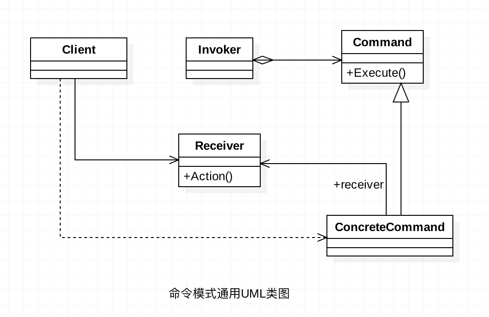
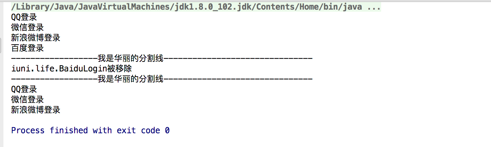

title: 命令模式
date: 2016-09-08 09:29:13
tags: Java 设计模式

**摘要:**

本篇主要内容是Java设计模式之命令模式(Command Pattern)。

  <!-- more -->

## 前言

​	正所谓只要功夫深，铁杵磨成针，坚持不懈，水滴石穿。学习也要坚持不懈，慢慢积累，才能达到以量变促成质变。在前进的过程中也要保持好良好的心态，不急不燥，脚踏实地，一步一个脚印。

## 命令模式介绍

​	命令模式(Command Pattern)是一种**行为型**设计模式。是一种高内聚的模式。命令模式相较于其他设计模式更为灵活多变。命令模式听名字就知道其关键点就是命令，在GUI开发中，命令模式的使用频率比较高一点，比如:一个按钮的点击是一个命令，我们可以采用命令模式。

## 命令模式定义

​	将一个请求封装成一个对象，从而让你使用不同的请求把客户端参数化，对请求排队或者记录请求日志，可以提供命令的撤销和恢复功能。

## 命令模式使用场景

* 使用场景非常广泛，只要你认为是命令的地方你就可以采用命令模式。
* 触发——反馈机制的处理。

## 命令模式通用UML类图

 

**说明：**

* **Receiver**

  接收角色，执行具体逻辑的角色。

* **Command**

  命令角色，需要执行的所有命令都在这里声明，是所有具体命令类的抽象接口。

* **ConcreteCommand**

  具体的命令角色，实现Command接口。

* **Invoker**

  调用者角色，接收到命令，并执行命令

* **Client**

  客户端角色。

## 命令模式使用实例

​	在安卓开发中，我们经常会使用第三方登录，这里我们就用开发第三方登录为简单示例。

1. Receiver接收者角色。

   ```java
   package iuni.life;

   /**
    * Created by  iuni.life on 2016/10/17.
    * yangfei's computer
    * 接受者角色
    */
   public class Receiver {
       public void qQLogin() {
           System.out.println("QQ登录");
       }

       public void weChatLogin() {
           System.out.println("微信登录");
       }

       public void weiBoLogin() {
           System.out.println("新浪微博登录");
       }

       public void baiDuLogin() {
           System.out.println("百度登录");
       }
   }

   ```

   ​

2. Command 抽象命令角色。

   ```java
   package iuni.life;

   /**
    * Created by  iuni.life on 2016/9/22.
    * yangfei's computer
    * 抽象命令角色
    */
   public interface Command {
       void execute();
   }

   ```

   ​

3. QQLogin 具体命令角色。

   ```java
   package iuni.life;

   /**
    * Created by  iuni.life on 2016/10/17.
    * yangfei's computer
    */
   public class QQLogin implements Command {
       private Receiver receiver;

       public QQLogin(Receiver receiver) {
           this.receiver = receiver;
       }

       @Override
       public void execute() {
           receiver.qQLogin();
       }
   }

   ```

   ​

4. WeChatLogin 具体命令角色。

   ```java
   package iuni.life;

   /**
    * Created by  iuni.life on 2016/10/17.
    * yangfei's computer
    */
   public class WeChatLogin implements Command {
       private Receiver receiver;

       public WeChatLogin(Receiver receiver) {
           this.receiver = receiver;
       }

       @Override
       public void execute() {
           receiver.weChatLogin();
       }
   }

   ```

   ​

5. WeiBoLogin 具体命令角色。

   ```java
   package iuni.life;

   /**
    * Created by  iuni.life on 2016/10/17.
    * yangfei's computer
    * 具体命令角色类
    */
   public class WeiBoLogin implements Command {
       private Receiver receiver;

       public WeiBoLogin(Receiver receiver) {
           this.receiver = receiver;
       }

       @Override
       public void execute() {
           receiver.weiBoLogin();
       }
   }

   ```

   ​

6. BaiduLogin 具体命令角色。

   ```java
   package iuni.life;

   /**
    * Created by  iuni.life on 2016/10/17.
    * yangfei's computer
    */
   public class BaiduLogin implements Command {
       private Receiver receiver;

       public BaiduLogin(Receiver receiver) {
           this.receiver = receiver;
       }

       @Override
       public void execute() {
           receiver.baiDuLogin();
       }
   }

   ```

   ​

7. Client 客户端角色类

   ```java
   package iuni.life;

   /**
    * Created by  iuni.life on 2016/10/17.
    * yangfei's computer
    * 客户端角色类
    */
   public class Client {
       public static void main(String[] args) {
           //创建接受者
           Receiver receiver = new Receiver();
           //创建命令对象
           Command QQCommand = new QQLogin(receiver);
           Command weChatCommand = new WeChatLogin(receiver);
           Command weiBoCommand = new WeiBoLogin(receiver);
           Command baiduCommand = new BaiduLogin(receiver);
           //创建请求者
           Invoker invoker = new Invoker(QQCommand);
           invoker = new Invoker(weChatCommand);
           invoker = new Invoker(weiBoCommand);
           invoker = new Invoker(baiduCommand);
           //执行方法
           invoker.allAction();
           System.out.println("------------------我是华丽的分割线-------------------------------");
           invoker.removeAction(baiduCommand);
           System.out.println("------------------我是华丽的分割线-------------------------------");
           invoker.allAction();
         }
   }

     
   ```

   ​

8. 运行结果。

   


## 命令模式优缺点

### 优点

* **类间解耦**

  调用者与接收者之间没有任何依赖关系。调用者实现功能时只需要调用Command抽象类的execute方法就可以了，不需要了解到底是哪个接收者执行。

* **可拓展性**

  Command的子类可以非常容易的拓展，而调用者Invoker和高层次的模块Client不产生严重的代码耦合。

* **结合其他设计模式会更优秀**

  命令模式可以结合责任链模式，实现命令族解析任务；结合模板方法模式，可以减少Command子类膨胀的问题。

### 缺点

* 如果有N个命令，Command子类就是N个，子类膨胀的非常大。

## 后记

​	文章不足之处，望大家多多指点，共同学习，共同进步。

## 参考资料

- ***<<设计模式之蝉>>***  秦小波 著

## 个人博客

如想获得更好阅读体验，请访问个人博客网站：[iplugin.cn](http://www.iplugin.cn)
