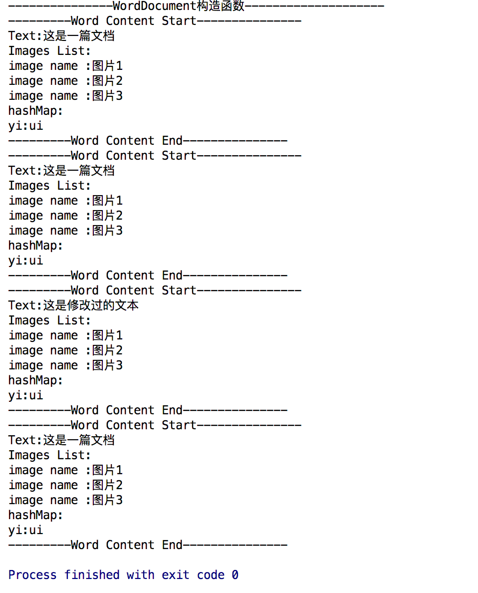
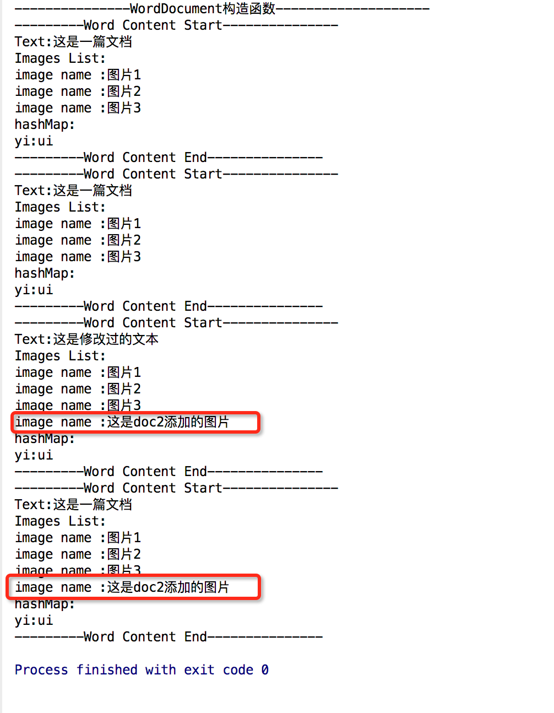
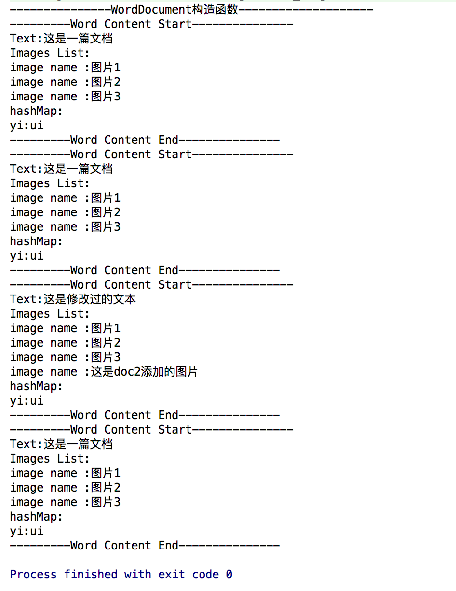

**摘要:**

Java设计模式之原型模式。

  <!-- more -->

## 前言

正所谓只要功夫深，铁杵磨成针，坚持不懈，水滴石穿。学习也要坚持不懈，慢慢积累，才能达到以量变促成质变。在前进的过程中也要保持好良好的心态，不急不燥，脚踏实地，一步一个脚印。

## 原型模式 介绍

原型模式是一个**创建型**的模式。原型二字即可表明该模式有一个样板实例，用户可以从这个样板的对象中复制一个与该对象内部属性一致的对象，也就是我们所说的克隆。

## 原型模式 定义

用原型实例指定创建对象的种类，并且通过拷贝这些原型创建新的对象。

## 原型模式 使用场景

* **资源优化场景**

  类初始化需要消耗非常多的资源，这个资源包括数据、硬件资源等。

* **性能和安全要求的场景**

  通过new产生一个对象需要非常繁琐的数据准备或访问权限。

* **一个对象多个修改者的场景**

  一个对象需要提供给其他对象访问，而且各个调用者可能都需要修改其值时，可以考虑使用原型模式拷贝多个对象供调用者使用。

  **说明**

  原型模式已经与Java融为一体，大家可以随手拿来使用。

## 原型模式 通用UML类图


**角色介绍**

* **client:** 客户端用户。
* **Prototype：** 抽象类或者接口，声明具备clone能力。
* **ConcretePrototype:** 具体的原型类。

## 原型模式使用实例

原型模式一般是要实现cloneable接口，并且重写clone方法，现在我们以文档拷贝来演示一个原型模式的实现。

***注意:*** clone 方法并不是Cloneable中的，而是Object中的方法，Cloneable 是一个标识接口，它表明这个类的对象是可以拷贝的。如果没有实现Cloneable接口却调用了clone()函数将抛出异常。 

1.    ConcretePrototype 角色

      ```java
      /**
      * Created by iuni.life on 16/8/5.
      * 文档类型,扮演的是ConCretePrototype角色,而cloneable是代表prototype角色
      */
      public class WordDocument implements Cloneable {
         //文本
         private String mText;
         //图片列表
         private ArrayList<String> mImages = new ArrayList<>();
         private HashMap<String, Object> hashMap = new HashMap<>();

         public WordDocument() {
             System.out.println("---------------WordDocument构造函数--------------------");
         }

         @Override
         protected WordDocument clone() {
             try {
                 WordDocument document = (WordDocument) super.clone();
                 document.mText = this.mText;
                 document.mImages = this.mImages;
                 document.hashMap = this.hashMap;
                 return document;
             } catch (Exception e) {

             }

             return null;
         }

         public HashMap<String, Object> getHashMap() {
             return hashMap;
         }

         public void setHashMap(HashMap<String, Object> hashMap) {
             this.hashMap = hashMap;
         }

         public void addMap(String key, String value) {
             hashMap.put(key, value);
         }

         public String getmText() {
             return mText;
         }

         public void setmText(String mText) {
             this.mText = mText;
         }

         public ArrayList<String> getmImages() {
             return mImages;
         }

         public void setmImages(ArrayList<String> mImages) {
             this.mImages = mImages;
         }

         public void addImages(String image) {
             this.mImages.add(image);
         }

         //打印文档内容
         public void showDocument() {
             System.out.println("---------Word Content Start---------------");
             System.out.println("Text:" + mText);
             System.out.println("Images List:");
             for (String imgName : mImages) {
                 System.out.println("image name :" + imgName);
             }
             System.out.println("hashMap:");
             for (String key : hashMap.keySet()) {
                 System.out.println(key + ":" + hashMap.get(key));

             }

             System.out.println("---------Word Content End---------------");
         }
      }
      ```

2. 测试Client类

      ```java
          /**
      * Created by iuni.life on 16/8/5.
      */
       public class Client {
           public static void main(String[] args) {
               //构建文档对象
               WordDocument originDoc = new WordDocument();
               originDoc.setmText("这是一篇文档");
               originDoc.addImages("图片1");
               originDoc.addImages("图片2");
               originDoc.addImages("图片3");
               originDoc.addMap("yi", "ui");
               originDoc.showDocument();

               //一万原始文档为模板,拷贝一份副本
               WordDocument doc2 = originDoc.clone();
               originDoc.showDocument();
               //修改文档副本,不会影响原始文档
               doc2.setmText("这是修改过的文本");
               doc2.showDocument();
               
               originDoc.showDocument();
           }
       }
      ```

      ​

3. 运行结果

      

      ***说明:*** 通过运行结果可以知道doc2是通过originDoc.clone创建的，并且doc2首次输出的时候和originDoc 是一样的结果，即doc2是originDoc 的一个拷贝，而doc2得文本内容更改后，originDoc的文本并没有变化，并没有受到影响，这样就保证了originDoc的安全性.。

      **注意:** 通过clone拷贝对象的时候并不会执行构造函数。如果在构造函数中有需要一些特殊的初始化，在使用Cloneable实现拷贝的时候，需要注意这一点。

      ​
## 原型模式的深拷贝和浅拷贝

### 浅拷贝

上述原型模式的实例其实是一个浅拷贝，也叫影子拷贝，这种拷贝实际上并不是将原始文档的所有字段都重新构造一份，而是将副本文档的字段引用原始文档的字段。

比如改变上述client类中Image List的值：

```java
/**
 * Created by iuni.life on 16/8/5.
 */
public class Client {
    public static void main(String[] args) {
        //构建文档对象
        WordDocument originDoc = new WordDocument();
        originDoc.setmText("这是一篇文档");
        originDoc.addImages("图片1");
        originDoc.addImages("图片2");
        originDoc.addImages("图片3");
        originDoc.addMap("yi", "ui");
        originDoc.showDocument();

        //一万原始文档为模板,拷贝一份副本
        WordDocument doc2 = originDoc.clone();
        originDoc.showDocument();
        //修改文档副本,不会影响原始文档
        doc2.setmText("这是修改过的文本");
      	//doc2 新增自己的图片
        doc2.addImages("这是doc2添加的图片");
        doc2.showDocument();

        originDoc.showDocument();
    }
}
```

执行结果为：



从图中可以看到doc2新增的图片，originDoc 也新增了同样的一张图片，那么如何解决这个问题呢，那就需要深拷贝。

### 深拷贝

那什么是深拷贝呢，两个对象之间没有任何瓜葛，你修改你的，我修改我的，不相互影响，对于引用类型的字段也要采用拷贝的形式，而不是单纯引用的形式，这才叫深拷贝。

下面我们只需修改上述例子的ConcretePrototype 角色**WordDocument类**中的clone方法，以实现深拷贝:

```java
    @Override
    protected WordDocument clone() {
        try {
            WordDocument document = (WordDocument) super.clone();
            document.mText = this.mText;
//            document.mImages=this.mImages;
//            document.hashMap=this.hashMap;
            //对MImages对象也调用clone对象,进行深拷贝
            document.mImages = (ArrayList<String>) this.mImages.clone();
            document.hashMap = (HashMap<String, Object>) this.hashMap.clone();
            return document;
        } catch (Exception e) {

        }

        return null;
    }
```

client不动，运行后的结果为：



从上述图片可以看到doc2添加了图片，originDoc并没有受到影响，doc2新增的图片在originDoc中并没有找到。

**建议:** 在开发过程中，为了减少错误，建议大家使用深拷贝，避免因操作副本影响原始对象。

## 原型模式优缺点

### 优点

*  **性能优良**

  原型模式是在内存二进制流的拷贝，要比直接new一个对象性能好很多，特别是在一个循环体内产生大量的对象时，原型模式可以更好的体现其优点。

### 缺点

​	这既是优点也是缺点，直接在内存中拷贝，构造函数不会执行。优点是减少了约束，缺点也是减少了约束，大家在实际应用中应该需要考虑这一点。

## 后记

文章不足之处，望大家多多指点，共同学习，共同进步。

## 参考资料

- ***<<设计模式之蝉>>***  秦小波 著


## 个人博客

[iplugin.cn](http://www.iplugin.cn)

