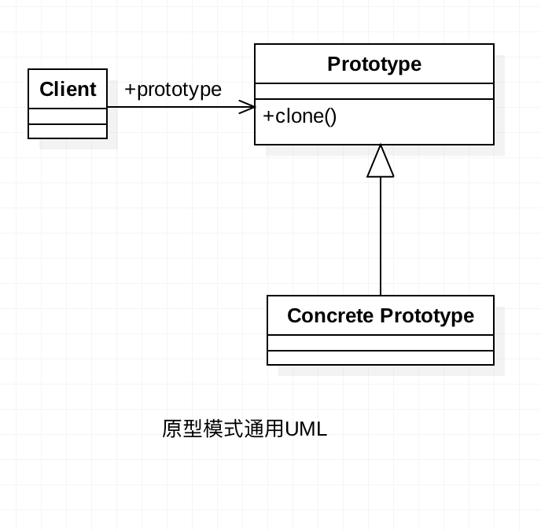

## 前言

正所谓只要功夫深，铁杵磨成针，坚持不懈，水滴石穿。学习也要坚持不懈，慢慢积累，才能达到以量变促成质变。在前进的过程中也要保持好良好的心态，不急不燥，脚踏实地，一步一个脚印。

## 原型模式 介绍

原型模式是一个创建型的模式。原型二字即可表明该模式有一个样板实例，用户可以从这个样板的对象中复制一个与该对象内部属性一致的对象，也就是我们所说的克隆。

## 原型模式 定义

用原型实例指定创建对象的种类，并且通过拷贝这些原型创建新的对象。

## 原型模式 使用场景

* **资源优化场景**

  类初始化需要消耗非常多的资源，这个资源包括数据、硬件资源等。

* **性能和安全要求的场景**

  通过new产生一个对象需要非常繁琐的数据准备或访问权限。

* **一个对象多个修改者的场景**

  一个对象需要提供给其他对象访问，而且各个调用者可能都需要修改其值时，可以考虑使用原型模式拷贝多个对象供调用者使用。

  **说明**

  原型模式已经与Java融为一体，大家可以随手拿来使用。

## 原型模式 通用UML类图

**角色介绍**

* **client:** 客户端用户。
* **Prototype：** 抽象类或者接口，声明具备clone能力。
* **ConcretePrototype:** 具体的原型类。

## 原型模式使用实例

