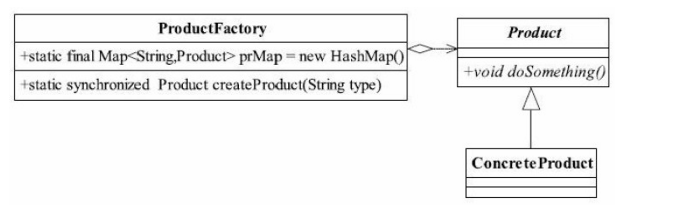

## 前言

​	正所谓只要功夫深，铁杵磨成针，坚持不懈，水滴石穿。学习也要坚持不懈，慢慢积累，才能达到以量变促成质变。在前进的过程中也要保持好良好的心态，不急不燥，脚踏实地，一步一个脚印。

## 工厂方法模式 介绍

​	工厂方法模式（Factory Pattern）是一种**创建型设计模式**，是日常开发中使用频率较高的一种设计模式。下面就要我们一起去了解一下工厂方法设计模式。

<!-- more -->

## 工厂方法设计模式 定义

​	定义一个用于创建对象的接口，让子类决定实例化哪一个类。工厂方法使一个类的实例化延迟到其子类。

## 工厂方法设计模式 使用场景

* 工厂方法模式是new一个对象的替代品，所以在有需要生成对象的地方都可以使用，但是要慎重的考虑当前任务是不是需要增加一个工厂类进行管理，避免使自己的代码更加复杂。
* 需要灵活、可扩展的框架时，可以考虑采用工厂方法模式。

## 工厂方法设计模式 通用UML类图


**说明:**

* **Product**

  产品类的抽象方法，由具体的产品类去实现。

* **ConcreateProduct**

  具体的产品类，可以有多个。继承于Product

* **Creator**

  抽象工厂类，负责定义产品对象的产生。

* **ConcreateCreator**

  具体的工厂实现类，继承于Creator。

## 工厂方法模式使用实例

​	前面我们组装了一台台式机电脑，现在台式机电脑组装好了，但是还不能使用，我们需要在电脑上安装软件系统，但是软件系统无非就是电脑系统的安装（linux系列,windows系列，mac系列（黑苹果）等等）、各个硬件驱动程序的安装。
  	我们可以将每一种安装的电脑系统及驱动作为一个产品类，在抽象类中定义操作的方法。  	
​	下面就以此为例，实现工厂方法模式。

1.    抽象产品类。

      ```java
      package com.yf.designpatternandroid;

      /**
      * Created by yangfei on 16/8/15.
      * yangfei's computer.
      */
      public abstract class InstallSoftware {
         /**
          * 安装系统
          *
          * @param systemOs 系统
          */
         public abstract void installSystem(String systemOs);

         /**
          * 安装显卡驱动
          *
          * @param GPUType 显卡型号
          */
         public abstract void installGPUDriver(String GPUType);

         /**
          * 安装主板驱动
          *
          * @param mainBoxType 主板型号
          */
         public abstract void installMainBoxdriver(String mainBoxType);

         /**
          * 安装网卡驱动
          *
          * @param netCardType 网卡型号
          */
         public abstract void installNetCardDriver(String netCardType);

         /**
          * 安装声卡驱动
          *
          * @param audioType 声卡型号
          */
         public abstract void installAudioDriver(String audioType);

         /**
          * 安装USB驱动
          * @param usbDriverType(3.0,2.0,...)
          */
         public abstract void installUSBDriver(String usbDriverType);

         /**
          * 安装键盘驱动
          * @param keyBoardType 键盘型号
          */
         public abstract void installKeyBoardDriver(String keyBoardType);

         /**
          * 安装鼠标驱动
          * @param mouseType 鼠标型号
          */
         public abstract void installMouseDriver(String mouseType);
         /**
          * 软件系统安装完成
          * @return
          */
         public abstract String finish();
      }
      ```

      ​

2. 具体的产品Windows系统的电脑。

      ```java
                                     package com.yf.designpatternandroid;

                                     /**
      * Created by iuni.life on 16/8/15.
      *  yangfei's computer.
      *  具体的逻辑就不处理了
      */
         public class WindowsSoftware extends InstallSoftware {
             @Override
             public void installSystem(String systemOs) {
                 //系统下载安装处理
             }

             @Override
             public void installGPUDriver(String GPUType) {
                 //显卡驱动下载安装处理
             }

             @Override
             public void installMainBoxdriver(String mainBoxType) {
                 //主板驱动下载安装处理
             }

             @Override
             public void installNetCardDriver(String netCardType) {
                 //网卡驱动下载安装处理
             }

             @Override
             public void installAudioDriver(String audioType) {
                 //声卡驱动下载安装处理
             }

             @Override
             public void installUSBDriver(String usbDriverType) {
                 //USB驱动下载安装处理
             }

             @Override
             public void installKeyBoardDriver(String keyBoardType) {
                 //键盘驱动下载安装处理
             }

             @Override
             public void installMouseDriver(String mouseType) {
                 //鼠标驱动下载安装处理
             }
           
             @Override
             public String finish() {
                 return "You can use normal Windows PC";
             }
         }
      ```


3.    具体的产品类，Ubuntu系统的电脑。

      ```java
      package com.yf.designpatternandroid;

      /**
      * Created by iuni.life on 16/8/15.
      * yangfei's computer.
      */
      public class UbuntuSoftware extends InstallSoftware {
         @Override
         public void installSystem(String systemOs) {
             //系统下载安装处理
         }

         @Override
         public void installGPUDriver(String GPUType) {
             //显卡驱动下载安装处理
         }

         @Override
         public void installMainBoxdriver(String mainBoxType) {
             //主板驱动下载安装处理
         }

         @Override
         public void installNetCardDriver(String netCardType) {
             //网卡驱动下载安装处理
         }

         @Override
         public void installAudioDriver(String audioType) {
             //声卡驱动下载安装处理
         }

         @Override
         public void installUSBDriver(String usbDriverType) {
             //USB驱动下载安装处理
         }

         @Override
         public void installKeyBoardDriver(String keyBoardType) {
             //键盘驱动下载安装处理
         }

         @Override
         public void installMouseDriver(String mouseType) {
             //鼠标驱动下载安装处理
         }
       
         @Override
         public String finish() {
             return "You can use normal Ubuntu PC";
         }
      }
      ```

4. 具体的产品类，Mac 系统的电脑。

      ```java
                                   package com.yf.designpatternandroid;

                                   /**
      * Created by iuni.life on 16/8/15.
      * yangfei's computer.
      */
      public class MacSoftware extends InstallSoftware {
         @Override
         public void installSystem(String systemOs) {
             //系统下载安装处理
         }

         @Override
         public void installGPUDriver(String GPUType) {
             //显卡驱动下载安装处理
         }

         @Override
         public void installMainBoxdriver(String mainBoxType) {
             //主板驱动下载安装处理
         }

         @Override
         public void installNetCardDriver(String netCardType) {
             //网卡驱动下载安装处理
         }

         @Override
         public void installAudioDriver(String audioType) {
             //声卡驱动下载安装处理
         }

         @Override
         public void installUSBDriver(String usbDriverType) {
             //USB驱动下载安装处理
         }

         @Override
         public void installKeyBoardDriver(String keyBoardType) {
             //键盘驱动下载安装处理
         }

         @Override
         public void installMouseDriver(String mouseType) {
             //鼠标驱动下载安装处理
         }
       
         @Override
         public String finish() {
             return "You can use normal MacOs PC";
         }
      }
      ```

5. 抽象工厂类。

      ```java
       package com.yf.designpatternandroid;

                                      /**
      * Created by iuni.life on 16/8/16.
      * yangfei's computer.
      */
      public abstract class Factory {
         abstract <T extends InstallSoftware> T getComputer(Class<T> clz);
      }
      ```


6.    工厂类的具体实现。

      ```java
      package com.yf.designpatternandroid;

      /**
      * Created by iuni.life on 16/8/15.
      * yangfei's computer.
      */
      public class ComputerFactory extends Factory {

         /**
          * 利用反射方式生产具体的产品对象
          *
          * @param clz
          * @param <T>
          * @return
          */
         public <T extends InstallSoftware> T getComputer(Class<T> clz) {
             InstallSoftware installSoftware = null;
             try {
                 installSoftware = (InstallSoftware) Class.forName(clz.getName()).newInstance();
             } catch (InstantiationException e) {
                 e.printStackTrace();
             } catch (IllegalAccessException e) {
                 e.printStackTrace();
             } catch (ClassNotFoundException e) {
                 e.printStackTrace();
             }
             return (T) installSoftware;
         }
      }
      ```

      ​

7. 场景类。

      ```java
                    package com.yf.designpatternandroid;
                    /**
      * Created by iuni.life on 16/8/15.
      * yangfei's computer.
      */
      public class Client {
         public static void main(String[] args) {
             //现在生产一批windows系统的电脑
             //这里举例子说明,具体驱动就不一一列举了.
             ComputerFactory computerFactory = new ComputerFactory();
             WindowsSoftware windowsSoftware = computerFactory.getComputer(WindowsSoftware.class);
             windowsSoftware.installSystem("Windows 10");
             windowsSoftware.installAudioDriver("Windows AudioDriver");
             windowsSoftware.installGPUDriver("Windows GPUDriver");
             windowsSoftware.installKeyBoardDriver("Windows KeyBoardDriver");
             windowsSoftware.installMainBoxdriver("Windows MainBoxdrive");
             windowsSoftware.installMouseDriver("Windows MouseDriver");
             windowsSoftware.installNetCardDriver("Windows NetCardDriver");
             windowsSoftware.installUSBDriver("Windows USBDriver");
             System.out.println(windowsSoftware.finish());

             //现在要生产一批Ubuntu系统的电脑
             UbuntuSoftware ubuntuSoftware = computerFactory.getComputer(UbuntuSoftware.class);
             //Ubuntu系统一般只要安装好系统就可以
             ubuntuSoftware.installSystem("Ubuntu 14.04");
             System.out.println(ubuntuSoftware.finish());

             //现在又要生产一批Mac(黑苹果)系统的电脑
             MacSoftware macSoftware = computerFactory.getComputer(MacSoftware.class);
             //黑苹果安装就有点繁琐了,首先要找驱动什么的,替换原有驱动等等,如果对黑苹果有兴趣,可去远景论坛爬贴学习.
             //黑苹果应该是先把找好的驱动什么的融入到安装系统中,然后才开始安装mac系统
             macSoftware.installAudioDriver("Mac AudioDriver");
             macSoftware.installGPUDriver("Mac GPUDriver");
             macSoftware.installKeyBoardDriver("Mac KeyBoardDriver");
             macSoftware.installMainBoxdriver("Mac MainBoxdriver");
             macSoftware.installMouseDriver("Mac MouseDriver");
             macSoftware.installNetCardDriver("Mac NetCardDriver");
             macSoftware.installUSBDriver("Mac USBDriver");
             macSoftware.installSystem("Mac Os 10.11.6");
             System.out.println(macSoftware.finish());
         }
         }
      ```


8. 运行结果。

   

   ​

## 工厂方法模式的优缺点

### 优点

* **良好的封装性，代码结构清晰：**

  不需要知道对象的创建过程，降低模块间的耦合。

* **工厂方法模式的拓展性非常优秀：**

  在增加产品类的情况下，只要适当修改具体的工厂类或者拓展一个工厂类，就可以拥抱变化。例如在我们的例子中需要生产一个装radHat的系统的电脑，则只需要增加一个RedHatSoftware类，工厂类不需要做任何修改就可以完成系统拓展。

* **屏蔽产品类：**

  产品类的任何变化，调用者都无需关心，它只要关心产品的接口。

* **典型的解耦框架:**

  高层模块只需要知道产品的抽象类，其他的实现类无需关心，符合迪米特原则，我们不需要的就不要去交流，符合依赖倒置原则，只依赖产品的抽象，符合里氏替换原则，使用产品子类替换产品父类，当然也没有问题。

### 缺点

* **类结构的复杂化:**

  每次为工厂方法模式添加新的产品时就要编写一个新的产品类，还要引入抽象层。


## 工厂方法模式的拓展

​	工厂方法模式一般有4种拓展，分别为简单工厂模式、升级为多个工厂类、替换单例模式、延迟初始化。

​	下面我们详细说明这4个拓展。

1.  **简单工厂模式（静态工厂模式）**

    如果一个模块仅需要一个工厂类，使用静态方法就可以，所有我们把上诉工厂类的具体实现（ComputerFactory）里的方法改为静态就可以了:

    ```java
    /**
    * Created by iuni.life on 16/8/15.
    * yangfei's computer.
    */
    public class ComputerFactory{

       /**
        * 利用反射方式生产具体的产品对象
        *
        * @param clz
        * @param <T>
        * @return
        */
       public static  <T extends InstallSoftware> T getComputer(Class<T> clz) {
           InstallSoftware installSoftware = null;
           try {
               installSoftware = (InstallSoftware) Class.forName(clz.getName()).newInstance();
           } catch (InstantiationException e) {
               e.printStackTrace();
           } catch (IllegalAccessException e) {
               e.printStackTrace();
           } catch (ClassNotFoundException e) {
               e.printStackTrace();
           }
           return (T) installSoftware;
       }
    }
    ```

    **说明:**

    上诉代码与原有相比，有2处变化，一处是去掉了Factory抽象类,一处是把getComputer设为静态方法。

       场景类也要做一些适当变化:

    ```java
       /**
        * Created by iuni.life on 16/8/15.
        * yangfei's computer.
        */
       public class Client {
           public static void main(String[] args) {
               //现在生产一批windows系统的电脑
               //这里举例子说明,具体驱动就不一一列举了.
              
               WindowsSoftware windowsSoftware = ComputerFactory.getComputer(WindowsSoftware.class);
               windowsSoftware.installSystem("Windows 10");
               windowsSoftware.installAudioDriver("Windows AudioDriver");
               windowsSoftware.installGPUDriver("Windows GPUDriver");
               windowsSoftware.installKeyBoardDriver("Windows KeyBoardDriver");
               windowsSoftware.installMainBoxdriver("Windows MainBoxdrive");
               windowsSoftware.installMouseDriver("Windows MouseDriver");
               windowsSoftware.installNetCardDriver("Windows NetCardDriver");
               windowsSoftware.installUSBDriver("Windows USBDriver");
               System.out.println(windowsSoftware.finish());

               //现在要生产一批Ubuntu系统的电脑
               UbuntuSoftware ubuntuSoftware = ComputerFactory.getComputer(UbuntuSoftware.class);
               //Ubuntu系统一般只要安装好系统就可以
               ubuntuSoftware.installSystem("Ubuntu 14.04");
               System.out.println(ubuntuSoftware.finish());

               //现在又要生产一批Mac(黑苹果)系统的电脑
               MacSoftware macSoftware = ComputerFactory.getComputer(MacSoftware.class);
               //黑苹果安装就有点繁琐了,首先要找驱动什么的,替换原有驱动等等,如果对黑苹果有兴趣,可去远景论坛爬贴学习.
               //黑苹果应该是先把找好的驱动什么的融入到安装系统中,然后才开始安装mac系统
               macSoftware.installAudioDriver("Mac AudioDriver");
               macSoftware.installGPUDriver("Mac GPUDriver");
               macSoftware.installKeyBoardDriver("Mac KeyBoardDriver");
               macSoftware.installMainBoxdriver("Mac MainBoxdriver");
               macSoftware.installMouseDriver("Mac MouseDriver");
               macSoftware.installNetCardDriver("Mac NetCardDriver");
               macSoftware.installUSBDriver("Mac USBDriver");
               macSoftware.installSystem("Mac Os 10.11.6");
               System.out.println(macSoftware.finish());
             
                  }
       }

    ```


    **说明:**

    运行结果没有发生变化，而且调用者比较简单，缺点是工厂类的拓展比较困难，不符合开闭原则，但是它仍然是一个非常实用的设计模式。

2. **升级为多个工厂类**

   我们在做一个比较复杂的项目的时候，所有产品类都放到一个工厂方法中进行初始化会使代码结构不清晰。例如：一个产品类有5个具体实现。每个实现类的初始化（不仅仅是new，初始化包括new一个对象，并对对象设置一定的初始值）方法都不相同，如果写在一个工厂方法中，势必会导致该方法巨大无比，这时我们把工厂方法模式升级为多个工厂类就可以解决这个问题，下面我们还是以上述案例为例，但是每个电脑安装的驱动版本不同。下面是修改后的简单的UML类图(方法全部省略了)：

   

   我们以生产不同软件/系统版本的windows电脑为例，其他2种实现方式一致。

   其实就是在文章最开始的例子中把一个工厂类分成了3个工厂类，使其各个工厂各司其职，提升工厂产量。

   1.  Factory修改为

       ```java
       /**
       * Created by iuni.life on 16/8/16.
       * yangfei's computer.
       */
       public abstract class Factory {
          public abstract  InstallSoftware getComputer();
       }
       ```

   2. 增加WindowsFactory

       ```java
          /**
       * Created by yangfei on 16/8/16.
       */
       public class WindowsFactory extends Factory {

          @Override
         public InstallSoftware getComputer() {
              return new WindowsSoftware();
          }
       }
       ```

   3. 场景类

       ```java
          /**
       * Created by yangfei on 16/8/16.
       */
       public class Client2 {

          public static void main(String[] args) {
              //这里举例子说明,具体驱动就不一一列举了.
              WindowsFactory windowsFactory = new WindowsFactory();
              WindowsSoftware windowsSoftware = (WindowsSoftware) windowsFactory.getComputer();
              windowsSoftware.installSystem("Windows 10");
              windowsSoftware.installAudioDriver("Windows AudioDriver");
              windowsSoftware.installGPUDriver("Windows GPUDriver");
              windowsSoftware.installKeyBoardDriver("Windows KeyBoardDriver");
              windowsSoftware.installMainBoxdriver("Windows MainBoxdrive");
              windowsSoftware.installMouseDriver("Windows MouseDriver");
              windowsSoftware.installNetCardDriver("Windows NetCardDriver");
              windowsSoftware.installUSBDriver("Windows USBDriver");
              System.out.println(windowsSoftware.finish());
          }
         }
       ```

   **说明:**其他2种就不举例了，实现方式类似。实现各自的Factory使其继承自Factory抽象类。

3. **替换单例模式**

   通过反射实现，下面举个例子：

   1. 单例类

   ```java
       /**
       * Created by yangfei on 16/8/16.
       */
       public class Singleton {
          //不允许通过new产生一个对象
          private Singleton() {
          }

          public void doSomething() {
              //业务处理
          }
       }
   ```
   2. 	负责生成单例的工厂类

   ```java
      import java.lang.reflect.Constructor;
      import java.lang.reflect.InvocationTargetException;

      /**
       * Created by yangfei on 16/8/16.
       */
      public class SingletonFactory {
          private static Singleton singleton;
          static {
              try {
                  Class c1=Class.forName(Singleton.class.getName());
                  //获得无参构造
                  Constructor constructor=c1.getDeclaredConstructor();
                  //设置无参构造是可以访问的
                  constructor.setAccessible(true);
                  //产生一个实体对象
                  singleton=(Singleton)constructor.newInstance();
              } catch (ClassNotFoundException e) {
                  e.printStackTrace();
              } catch (NoSuchMethodException e) {
                  e.printStackTrace();
              } catch (IllegalAccessException e) {
                  e.printStackTrace();
              } catch (InstantiationException e) {
                  e.printStackTrace();
              } catch (InvocationTargetException e) {
                  e.printStackTrace();
              }
          }

          public static Singleton getSingleton() {
              return singleton;
          }
      }
   ```

4. **延迟初始化**

   何为延迟初始化（Lazy initialization）？一个对象被消费完毕后，并不立刻释放，工厂类保持其初始状态，等待再次被使用。延迟初始化是工厂方法模式的一个扩展应用，其通用类图如图如下所示。

   

   ProductFactory负责产品类对象的创建工作，并且通过prMap变量产生一个缓存，对需要再次被重用的对象保留，Product和ConcreteProduct是一个示例代码。ProductFactory如代码清单如下所示:

   ```java
       public class ProductFactory {
           private static final Map<String, Product> prMap = new HashMap();

           public static synchronized Product createProduct(String type)
                   throws Exception {
               Product product = null;
               // 如果Map中已经有这个对象
               if (prMap.containsKey(type)) {
                   product = prMap.get(type);
               } else {
                   if (type.equals("Product1")) {
                       product = new ConcreteProduct1();
                   } else {
                       product = new ConcreteProduct2();
                   }
                   // 同时把对象放到缓存容器中
                   prMap.put(type, product);
               }
               return product;
           }
       }
   ```

   通过定义一个Map容器，容纳所有产生的对象，如果在Map容器中已经有的对象，则直接取出返回；如果没有，则根据需要的类型产生一个对象并放入到Map容器中，以方便下次调用。

   延迟加载框架是可以扩展的，例如限制某一个产品类的最大实例化数量，可以通过判断Map中已有的对象数量来实现，这样的处理是非常有意义的，例如JDBC连接数据库，都会
   要求设置一个MaxConnections最大连接数量，该数量就是内存中最大实例化的数量。
   延迟加载还可以用在对象初始化比较复杂的情况下，例如硬件访问，涉及多方面的交互，则可以通过延迟加载降低对象的产生和销毁带来的复杂性。


## 后记

文章不足之处，望大家多多指点，共同学习，共同进步。

## 参考资料

- ***<<设计模式之蝉>>***  秦小波 著

## 个人博客

[iplugin.cn](http://www.iplugin.cn)

