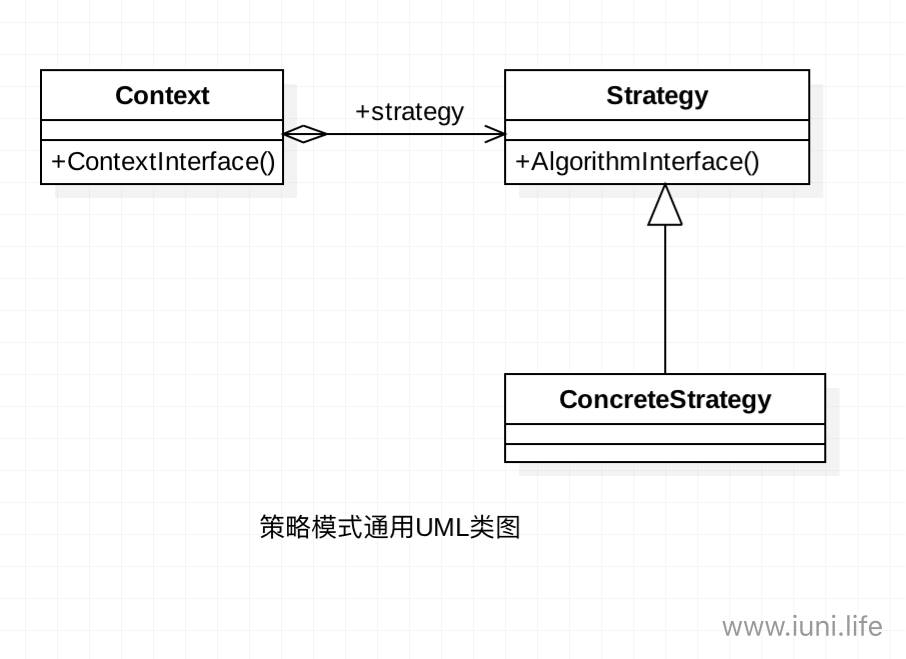
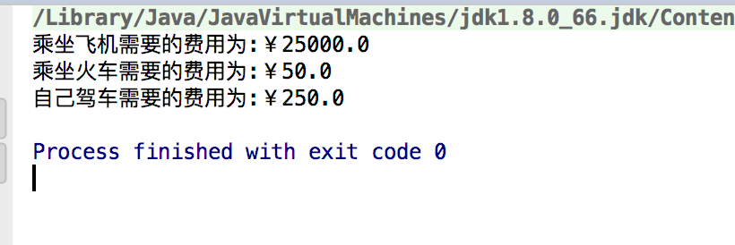

**摘要:**

本篇主要讲Java设计模式之策略模式。

  <!-- more -->

## 前言

​	正所谓只要功夫深，铁杵磨成针，坚持不懈，水滴石穿。学习也要坚持不懈，慢慢积累，才能达到以量变促成质变。在前进的过程中也要保持好良好的心态，不急不燥，脚踏实地，一步一个脚印。

## 策略模式介绍

​	策略模式也叫政策模式，是一种行为型设计模式，是一种比较简单的设计模式。策略模式采用了面向对象的继承和多态机制，下面让我们详细了解一下策略模式吧！

## 策略模式定义

​	定义一组算法，将每个算法都封装起来，并且使他们之间可以互换。

## 策略模式使用场景

* 多个类只有在算法或行为上稍有不同的场景。
* 算法需要自由切换的场景。
* 需要屏蔽算法规则的场景

## 策略模式通用UML类图

 

**说明:**

* **Context**

  他也叫作上下文角色，起承上启下封装作用，屏蔽高层模块对策略、算法的直接访问，封装可能存在的变化。

* **Strategy **

  策略、算法家族的抽象。通常为接口，定义每个策略或算法必须具有的方法和属性。是策略的抽象。

* **ConcreteStrategy**

  具体的策略实现。该类含有具体的算法。 

## 策略模式使用实例

​	快过中秋了，小杨准备回家团圆，因为家距离自己上班的地方500KM，所以小杨想选择一个比较便宜的回家方式，小杨调查了一下可选择的出行有三种，一做飞机，二自己驾车，三乘火车。这三种乘坐方式的价格不一致，坐飞机大约是没千米50元，自己驾车大约是每千米0.5元，做火车呢，每KM大约是0.1元，现在就让我们用策略模式实现一下小杨要计算的回家费用吧！

1.   **Strategy **,新建一个CalculateStrategy接口

     ```java
     package iuni.life;

     /**
     * Created by  iuni.life on 16/9/5.
     * yangfei's computer
     * 计算接口
     */
     public interface CalculateStrategy {
        float price(int km);
     }
     ```

     ​

2.   **ConcreteStrategy**,新建CarStrategy、PlaneStrategy、TrainStrategy实现接口CalculateStrategy

     ```java
              package iuni.life;

              /**
     * Created by  iuni.life on 16/9/5.
     * yangfei's computer
     * 自己开车  按每公里0.5元计算
     */
        public class CarStrategy implements CalculateStrategy {
            @Override
            public float price(int km) {
                return (float) 0.5 * km;
            }
        }
     ```

     ```java
       package iuni.life;
       /**
     * Created by  iuni.life on 16/9/5.
     * yangfei's computer
     * 乘飞机  按每公里50元计算
     */
      public class PlaneStrategy implements CalculateStrategy {
         @Override
        public float price(int km) {
            return 50 * km;
        }
           }
     ```

     ```java
      package iuni.life;

        /**
         * Created by  iuni.life on 16/9/5.
         * yangfei's computer
         * 乘火车   大约是每公里按0.1元计算
         */
        public class TrainStrategy implements CalculateStrategy {
            @Override
            public float price(int km) {
                return (float) (0.1 * km);
            }
        }
     ```

3.   **Context** ,新建Client

     ```java
         package iuni.life;
         /**
     * Created by  iuni.life on 16/9/5.
     * yangfei's computer
     */
     public class Client {
        CalculateStrategy calculateStrategy;
        static int km = 500;

        public static void main(String[] args) {
            Client client = new Client();
            //选择乘飞机的方式
            client.setCalculateStrategy(new PlaneStrategy());
            System.out.println("乘坐飞机需要的费用为:￥" + client.getPrice(km));
            //选择乘火车的方式
            client.setCalculateStrategy(new TrainStrategy());
            System.out.println("乘坐火车需要的费用为:￥" + client.getPrice(km));
            //选择自己驾车的方式
            client.setCalculateStrategy(new CarStrategy());
            System.out.println("自己驾车需要的费用为:￥" + client.getPrice(km));
        }

        /**
         * 设置出行方式
         *
         * @param calculateStrategy
         */
        public void setCalculateStrategy(CalculateStrategy calculateStrategy) {
            this.calculateStrategy = calculateStrategy;
        }

        /**
         * 获得出行费用
         *
         * @param km
         * @return
         */
        public float getPrice(int km) {
            return calculateStrategy.price(km);
        }
     }
     ```


4. 运行结果

   

## 策略模式优缺点

### 优点

* 算法可以自由切换。
* 结构清晰明了，使用简单直观。
* 操作封装更为彻底，简化了操作。
* 耦合度大大降低，只要实现接口即可，无需做其他修改。

### 缺点

* 随着策略的增加，策略类会越来越多。
* 所有的策略都要暴露出去。

## 策略模式的拓展

* 策略枚举

  上面的例子改成以下方式：

  1.   定义一个枚举类，实现方式如下:

       ```java
       package iuni.life;

       /**
       * Created by  iuni.life on 16/9/5.
       * yangfei's computer
       */
       public enum Calculator {
          //自驾
          CAR {
              public float price(int km) {
                  return (float) 0.5 * km;
              }
          },
          PLANE {//飞机

              public float price(int km) {
                  return (float) 50 * km;
              }
          },
          TRAIN {//火车

              public float price(int km) {
                  return (float) 0.1 * km;
              }
          };

          Calculator() {

          }

          public abstract float price(int km);
       }
       ```

  2.   修改Client

       ```java
          package iuni.life;

          /**
       * Created by  iuni.life on 16/9/5.
       * yangfei's computer
       */
       public class Client {
           static int km = 500;

           public static void main(String[] args) {
               System.out.println("乘坐飞机需要的费用为:￥" + Calculator.PLANE.price(km));
               System.out.println("乘坐火车需要的费用为:￥" + Calculator.TRAIN.price(km));
               System.out.println("自己驾车需要的费用为:￥" + Calculator.CAR.price(km));
           }
       }
       ```
       ​

  3.   运行结果

        ​

  可以看出：

* 该例子的Calculator是一个枚举。
* Calculator是一个浓缩了策略模式的枚举。

  **注意:**

  策略枚举是一个非常优秀和方便的模式，但是其受到枚举类型的限制，每个枚举项都是public、final、static的，拓展性受到了一定的约束，因此在系统开发中，枚举策略一般担当不经常发生变的角色。

## 后记

​	文章不足之处，望大家多多指点，共同学习，共同进步。

## 参考资料

* ***<<设计模式之蝉>>***  秦小波 著

## 个人博客

如想获得更好阅读体验，请访问个人博客网站：[iuni.life](http://www.iuni.life)