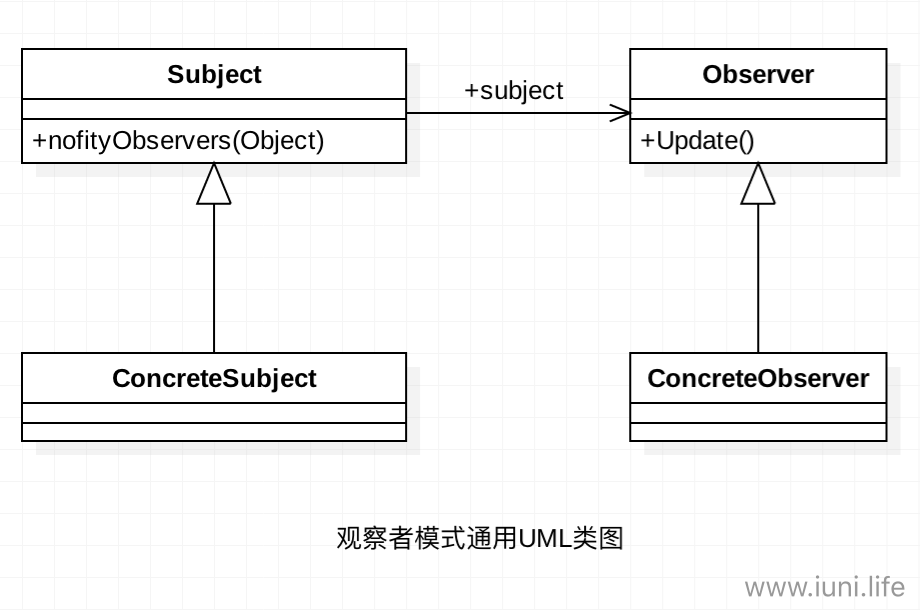
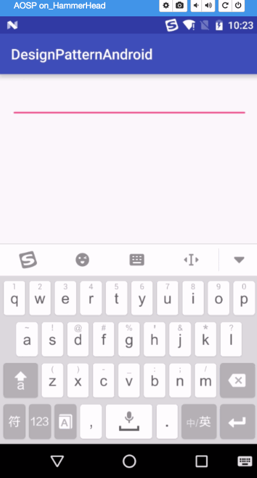

**摘要:**

本篇主要讲Java设计模式之观察者模式。

  <!-- more -->

[TOC]

## 前言

​	当心浮气躁时，告诫自己要静下心来，一步一步来，不要急不要燥。

## 观察者模式介绍

​	观察者模式也叫做**发布订阅模式**，是一种行为型设计模式。观察者模式最常用的地方是GUI系统、订阅---------发布系统。尤其是GUI系统，使用观察者模式可以使UI层与业务逻辑解耦。

## 观察者模式定义

​	定义对象间一种一对多的依赖关系，使得每当一个对象改变状态。则所有依赖于它的对象都会得到通知并被自动更新。

## 观察者模式使用场景

* **关联行为场景**

  需要注意的是，关联行为是可以拆分的，并不是“组合”关系。

* **事件多级触发场景。**

* **跨系统的消息交换场景，如消息队列、事件总线的处理机制。**

  ​

## 观察者模式通用UML类图

 

**说明:**

* **Subject**

  被观察者，一般是抽象类或者是实现类，主要功能是管理观察者（动态的增加、取消观察者）并且通知观察者。

* **ConCreteSubject**

  具体的被观察者，定义被观察者自己的业务逻辑，同时定义对哪些事件进行通知。

* **Observer**

  观察者，一般是抽象类或者是实现类，对接收到的信息进行处理。

* **ConcreteObserver**

  具体的观察者，通过接收的信息，实现各个观察者自己的业务逻辑。

## 观察者模式使用实例

​	现在有这样一个功能需求：在Android的一个界面上，有三个控件，分别为Edittext,TextView,ImageView，当EditText按下键盘的回车键（或者确认键）时，TextView显示EditText输入的文字，ImageView根据输入的文字显示相应的图片。如果运用观察者模式去做的话，EditText是被观察者，TextView和ImageView是观察者，当EditText输入的时候按下回车键，ImageView和TextView通过接受的信息根据自己的业务逻辑进行相应的处理。下面就让我们来实现一下。

1. 重写EditText，使其成为被观察者

   ```java
   package com.yf.designpatternandroid;

   import android.content.Context;
   import android.util.AttributeSet;
   import android.view.KeyEvent;
   import android.view.inputmethod.EditorInfo;
   import android.widget.EditText;
   import android.widget.TextView;

   import java.util.Observable;
   import java.util.Observer;
   ```


   /**
    * Created by iuni.life on 16/9/7.
    * yangfei's computer.
    */
   public class MyEditText extends EditText {
     //使用内部类的方式实现被观察者
       private Content content;
    
       public MyEditText(Context context) {
           super(context);
       }
    
       public MyEditText(final Context context, AttributeSet attrs) {
           super(context, attrs);
           content = new Content();
           //对输入的内容进行监听
           setOnEditorActionListener(new OnEditorActionListener() {
               @Override
               public boolean onEditorAction(TextView textView, int i, KeyEvent keyEvent) {
                   if (i == EditorInfo.IME_ACTION_SEARCH || i == EditorInfo.IME_ACTION_DONE ||
                           keyEvent.getAction() == KeyEvent.ACTION_DOWN &&
                                   keyEvent.getAction() == KeyEvent.KEYCODE_ENTER) {
                       //触发各个Observer
                       content.setEditTextContent(getText().toString());
    
                   }
    
                   return false;
               }
           });
       }
    
       public MyEditText(Context context, AttributeSet attrs, int defStyleAttr) {
           super(context, attrs, defStyleAttr);
       }
    
       /**
        * 添加观察者
        *
        * @param observer
        */
       public void addObserver(Observer observer) {
           content.addObserver(observer);
       }
   	//被观察者需要继承Observable
       private class Content extends Observable {
           private String editTextContent;


           public void setEditTextContent(String editTextContent) {
               this.editTextContent = editTextContent;
               //标识状态或者内容发生改变
               setChanged();
               //通知所有的观察者
               notifyObservers(editTextContent);
           }
       }
   }

   ```

   ​

2. 重写TextView，使其成为观察者

   ```java
   package com.yf.designpatternandroid;

   import android.content.Context;
   import android.util.AttributeSet;
   import android.util.Log;
   import android.widget.TextView;

   import java.util.Observable;
   import java.util.Observer;

   /**
    * Created by iuni.life on 16/9/7.
    * yangfei's computer.
    * 观察者需要实现接口Observer，并在update方法中实现业务逻辑
    */
   public class MyTextView extends TextView implements Observer {
       public MyTextView(Context context) {
           super(context);
       }

       public MyTextView(Context context, AttributeSet attrs) {
           super(context, attrs);
       }

       public MyTextView(Context context, AttributeSet attrs, int defStyleAttr) {
           super(context, attrs, defStyleAttr);
       }

       @Override
       public void update(Observable observable, Object o) {
           Log.d("MyTextView", "Observer:MyTextView收到通知:" + o);
           setText(o.toString());
       }
   }

   ```

   ​

3. 重写ImageView，使其成为观察者

   ```java
   package com.yf.designpatternandroid;

   import android.content.Context;
   import android.media.Image;
   import android.util.AttributeSet;
   import android.util.Log;
   import android.widget.ImageView;

   import java.util.Observable;
   import java.util.Observer;

   /**
    * Created by iuni.life on 16/9/7.
    * yangfei's computer.
    * 观察者需要实现接口Observer，并在update方法中实现业务逻辑
    */
   public class MyImageView extends ImageView implements Observer {
       public MyImageView(Context context) {
           super(context);
       }

       public MyImageView(Context context, AttributeSet attrs) {
           super(context, attrs);
       }

       public MyImageView(Context context, AttributeSet attrs, int defStyleAttr) {
           super(context, attrs, defStyleAttr);
       }

       @Override
       public void update(Observable observable, Object o) {
           Log.d("MyImageView", "Observer:MyImageView收到通知:" + o);
           String content = o.toString();
           if (o.equals("iuni")) {
               setImageResource(R.mipmap.ic_launcher);
           } else {
               setImageResource(R.mipmap.test);
           }
       }
   }

   ```

   ​

4. 在布局文件中引用重写的三个控件

   ```xml
   <?xml version="1.0" encoding="utf-8"?>
   <LinearLayout xmlns:android="http://schemas.android.com/apk/res/android"
       xmlns:tools="http://schemas.android.com/tools"
       android:layout_width="match_parent"
       android:layout_height="match_parent"
       android:orientation="vertical"
       android:paddingBottom="@dimen/activity_vertical_margin"
       android:paddingLeft="@dimen/activity_horizontal_margin"
       android:paddingRight="@dimen/activity_horizontal_margin"
       android:paddingTop="@dimen/activity_vertical_margin"
       tools:context="com.yf.designpatternandroid.MainActivity">

       <com.yf.designpatternandroid.MyEditText
           android:id="@+id/id_et"
           android:layout_width="match_parent"
         android:singleLine="true"
           android:layout_height="wrap_content" />

       <com.yf.designpatternandroid.MyTextView
           android:id="@+id/id_tv"
           android:layout_width="match_parent"
           android:layout_height="wrap_content" />

       <com.yf.designpatternandroid.MyImageView
           android:id="@+id/id_iv"
           android:layout_width="200dp"
           android:layout_height="200dp"
           />
   </LinearLayout>

   ```

   ​

5. 测试代码

   ```java
   package com.yf.designpatternandroid;

   import android.support.v7.app.AppCompatActivity;
   import android.os.Bundle;
   import android.view.View;
   import android.widget.AutoCompleteTextView;
   import android.widget.ImageView;
   import android.widget.Toast;

   public class MainActivity extends AppCompatActivity {

       private MyEditText myEditText;
       private MyTextView myTextView;
       private MyImageView myImageView;

       @Override
       protected void onCreate(Bundle savedInstanceState) {
           super.onCreate(savedInstanceState);
           setContentView(R.layout.activity_main);
           myEditText = (MyEditText) findViewById(R.id.id_et);
           myImageView = (MyImageView) findViewById(R.id.id_iv);
           myTextView = (MyTextView) findViewById(R.id.id_tv);

           myEditText.addObserver(myImageView);
           myEditText.addObserver(myTextView);
       }
   }

   ```

6. 效果展示

    


## 观察者模式优缺点

### 优点

* **观察者和被观察者之间是抽象耦合。**
* **可以建立一套触发机制。**
* **增强系统的灵活性，可拓展性。**

### 缺点

* **一个被观察者，多个观察者，开发效率和运行效率需要考虑。**
* **一个被观察者，多个观察者，调试比较复杂。**
* **Java中的消息通知默认是顺序执行，一个观察者卡壳，会影响整体的执行效率。（这种情况一般会采取异步的方式处理）**

## 后记

​	文章不足之处，望大家多多指点，共同学习，共同进步。

## 参考资料

- ***<<设计模式之蝉>>***  秦小波 著

## 个人博客

若想获得更好阅读体验，请访问个人博客网站：[iplugin.cn](http://www.iplugin.cn)